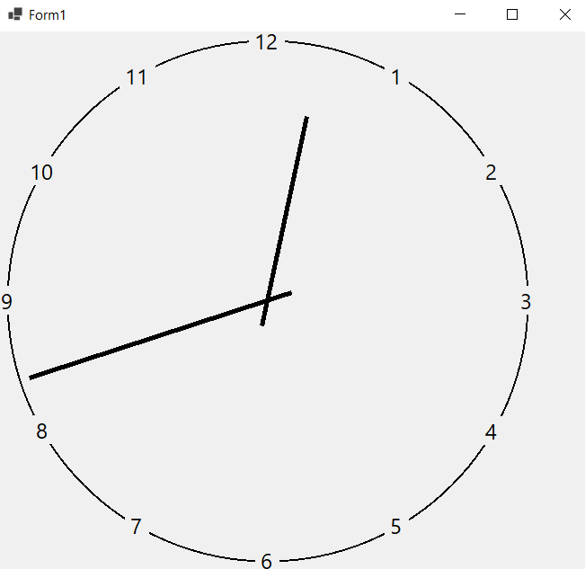
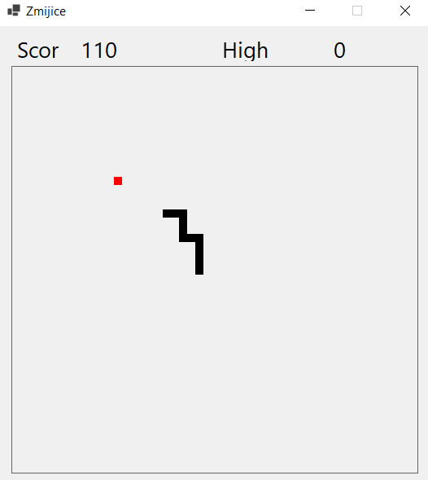

# C# projektni zadaci

## Klijent-Server web socket

Ovaj projekat kreira dve klase - klijenta i servera koji se međusobno povezuju pomoću socketa. Za razmenu se koristi "izmišljeni" protokol, odnosno klijent salje zahtev odredjenog tipa (A-G) i server na osnovu tipa odgvara sa različitim informacijama.

Projekat je uradjen kao domaći na nekom univerzitetu u Sloveniji.

### Prikaz:

<i>server - startup<i>

<i>client - startup<i>

<i>server - new client connected<i>

<i>client - send type A request<i>

<i>server - respond to type A request<i>

<i>client - send type G request<i>

<i>server - respond to type G request<i>

## Peer2Peer Network

Ovaj projekat kreira peer to peer mrežu koja omogućava slanje poruka u mreži. Postoji Discovery Server koji čuva sve trenutno povezane uređaje i svaki klijent pri povezivanju u mrežu traži od servera adrese svih čvorova sa kojim se potom povezuje. Peer uređaji podržavaju onNewNodeConnect, onNodeDisconnect i onMessage događaje.

### Prikaz

<i>server - startup<i>

<i>server - logs<i>

<i>peer - new node connected <i>

<i>peer - send a message<i>

<i>peer - message recieved<i>

<i>peer - node diconnected<i>

## Blockchain

Koristi peer to peer mrežu da omogući kreiranje novih blokova u chain. Koristi mining i proof of work.

Projekat napravljen kao domaći na nekom univerzitetu u Sloveniji.

### Prikaz

<i>server - startup<i>

<i>server - logs<i>

<i>app - blockchain tab<i>

<i>app - network tab<i>

<i>app - logs tab<i>

<i>block details form<i>

## Sat

Projekat iscrtava sat u Windows Formi. Sat je responzivan i uvek je pravilan krug, bez obzira na dimenzije prozora. Koristi trigonometrijske funkcije za preračunavanje pozicija kazaljki i brojeva.

Projekat je nastao kao vežba o grafici i tajmerima u C# za predmet programiranje u 3. razredu srednje škole.

<i>sat<i>

### Prikaz

## Zmijice

Omogućava igranje zmijica u Windows Form Aplikaciji. Zmijica se pomeranjem korišćenjem UP, DOWN, LEFT i RIGHT ARROW dugmića, a space pauzira igru.

Projekat je nastao kao vežba o grafici i key eventima u C# za predmer programiranje u 3. razredu srednje škole.

## Prikaz

<i>igra<i>

<i>kraj igre i meni<i>

